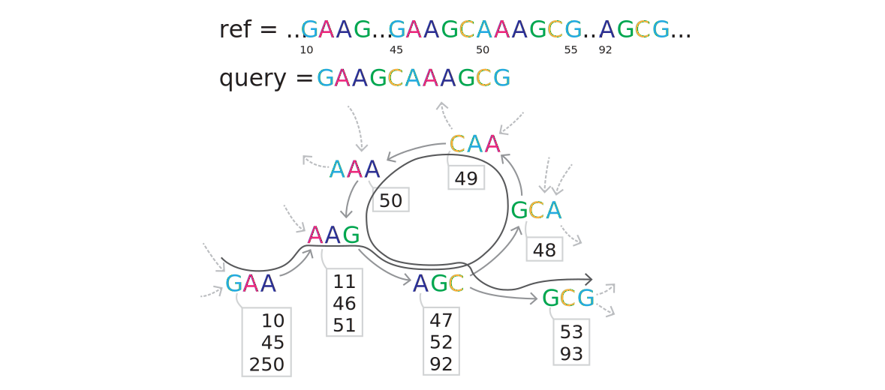

# tinymasker — demonstration of de Bruijn index for ultrasensitive seed-and-extend alignment

Tinymasker is an experimental tool that computes seed-and-extend local alignments using short exact k-mer matches. The key component is **de Bruijn index**, which is a hybrid data structure of de Bruijn graph and hash table. It at least halves the number of random accesses on querying k-mer matching positions, and enables quicker enumeration of seeds than existing hashmap- or suffix-array-based indices.


## Supported targets

* **Processors:** x86\_64 (Intel or AMD) with SSE4.2
* **Operating Systems:** Linux and macOS
* **Compilers:** gcc, clang, and icc


## Usage

### Installation

```shell
$ make CC=gcc -j4
$ make install PREFIX=$HOME/local		# or just copy `tinymasker` to $HOME/local/bin or somewhere appropriate
```


### Run

Align reference sequences (e.g. collection of repeat elements) onto query sequences (e.g. assembly contigs):

```shell
$ tinymasker -t4 -d reference.tmi reference.fa
$ tinymasker -t4 reference.tmi query.fa > out.paf
```

or

```shell
$ tinymasker -t4 reference.fa query.fa > out.paf
```

### Notes

**Important note: the tool is experimental, not intended for practical use in genome analyses.**

Tinymasker attempts to report all alignments with a score above a threshold. That is, it reports tremendous number of alignments when the reference database contains redundant sequence fragments (repetitve sequences). So, when you apply tinymasker to any kind of sequence analysis, you would need another filtering algorithm to filter only significant alignments from the raw output.

The length of each sequence on the database side must not exceed 32 kbp. By default, it will stop when such sequence is found in the reference-side input. By giving `-L` option, you can tell tinymasker to continue computation by just removing (ignoring) the sequence.


## Algorithm

### Seeding with de Bruijn index

It is really common for bioinformatics tool developers to use hashmap or suffix array for implementing k-mer indices for seeding. However, these data structures require multiple memory accesses (random DRAM access) for each k-mer search. I wondered that this memory access could be reduced to once per search if I put metadata and k-mer positions in one place, and designed "de Bruijn index."

The idea of the de Bruijn index is that, we can make a direct transition from one matching state to another by following an edge of a de Bruijn graph. Since each node corresponds to an unique k-mer and any pair of adjacent nodes shares overlapping (k-1)-mer on the de Bruijn graph, an edge transition on the graph is equivalent to shifting a k-mer match by one column on the embedded sequence.

#### Monolithic node structure, for loading everything at once

The actual data structure of the de Bruijn index was carefully designed not to issue any memory access other than the edge transition. I put the matching position table (an array of reference-side positions where the k-mer is found) right after metadata of a node so that they are on the same cache line. All the variables in the metadata struct and position array are in 16-bit packed representation. By this design, the two operations, fetching a pointer for transition to the next node (and issuing the next load) and copying matching positions for the node to a seed bin, can be executed at once using only SIMD operations.



*Figure 1. Illustration of the de Bruijn index, indexing a reference sequence ...GAAG...GAAGCAAAGCG...AGCG... . Transition on the graph is equivalent to forwarding matching state by one column. The node GAA is a matching state for the first three bases (GAA) of the query, and the next AAG is a matching state for the next three bases.*

#### Filtering redundant seeds out by determining continuity of matches

I also added redundant seed filter, by making use of the property peculiar to de Bruijn graphs. Since we already know that (k - 1)-base prefix of any node continues to match wherever we jump over the outgoing edges, we can make use of this nature for determining if a match at a certain reference position continues at the next column. That is, comparing the next reference base for that position to that on the query tells if the match at that position continues or not.

The concept was further optimized in the implementation. To encode the next reference bases implicitly in the position array, the positions are sorted by the next reference bases, and chunked according to it. To filter out redundant continuous matches, only the chunks for bases that don't match at the next column are copied to the seed bin. In addition, the procedure is disabled once every 16 times so that we don't filter contiguous k-mers too much.

#### Reducing the number of nodes

Lastly, I explain how the footprint of the de Bruijn index is reduced. It is for handling larger k, where large fraction of k-mers in the 4<sup>k</sup> space are absent. Because allocating nodes for these absent k-mers is a waste of memory when k is relatively large, absent k-mers should be removed from the graph.

Removing the absent nodes results in losing track of transitions when the next node doesn't exist. In my implementation of the de Bruijn index, these missing nodes are treated as an instruction to retrun to the initial state. Matching state is recovered from the initial state by following appropriate edges k times. After k transitions, it's finally back to the "complete match" state and continues to the nomal seed expansion procedure.

In the current implementation, the recovering and normal transitions share the same edges and nodes. It means that we need at least 4<sup>k - 1</sup> nodes to cover all the possible recovering paths, and the number of nodes cannot be less than 1 / 4 of the original. The memory usage still becomes a burden with the current implementation, so the application is limited to short k-mer matches (in other words, "ultrasensitive").


### Chaining seeds

The enumerated seeds are converted into chains by a greedy chaining algorithm. It repeats an operation of linking the nearest seed to the current forefront seed and forwarding the forefront to the linked seed. Picking the first element on a sorted seed array as a root seed, it repeats the linking operation until no seed is found within a certain range of the last forefront.


### Extension

The calculated chain is converted into an alignment path by the X-drop DP algorithm using [dozeu](https://github.com/ocxtal/dozeu). To prevent the seed from remaining as an artifact in the alignment path, tinymasker calculates a pair of one-way extension (semi-global extension) in a round-trip manner. Starting an extension from the end of the previous extension toward the opposite direction, it computes an alignment path that is maximal, or that can't be extended further, at the both ends.

### Brief discussion on the algorithm and implementation

Personally I think the de Bruijn index is a quite interesting algorithm, but it's probably not very practical. This is because there are not many applications where quick short k-mer enumeration is extremely important. One possible exception is exhaustive detection of short repeat sequences from a reference sequence. The tinymasker was named after this potential application. I believe it's possible to integrate tinymasker or its derivative into repeat annotation tools such as RepeatMasker.

It might also be possible to remove the reduction lower bound, 1 / 4, entirely by adopting an additional data structure. Since the bound comes from the need for the feeder paths for the first k transitions, it can be removed the path is emulated by another data structure. Hash table is one possible choice, where key is (k - 1)-mer that is a prefix of a matching k-mer and value is a pointer to the k-mer node. However, such data structure impairs the advantage of the de Bruijn index that minimizes the number of random memory accesses.

Even in such a setting, the de Bruijn index might not lose its advantage over the suffix array. The property that de Bruijn index can directly remove redundant matches is essential to keep the memory required for seed enumeration small. Also, a single (long) match after the redundant match removal can be treated as a maximum exact match. So if the information that the de Bruijn index can hold is sufficient for the downstream algorithms, the de Bruijn index could be a good alternative to the suffix array.


## License

Copyright (2019-2020) Hajime Suzuki

MIT


